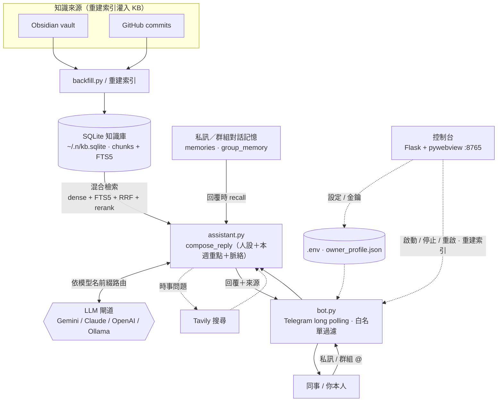
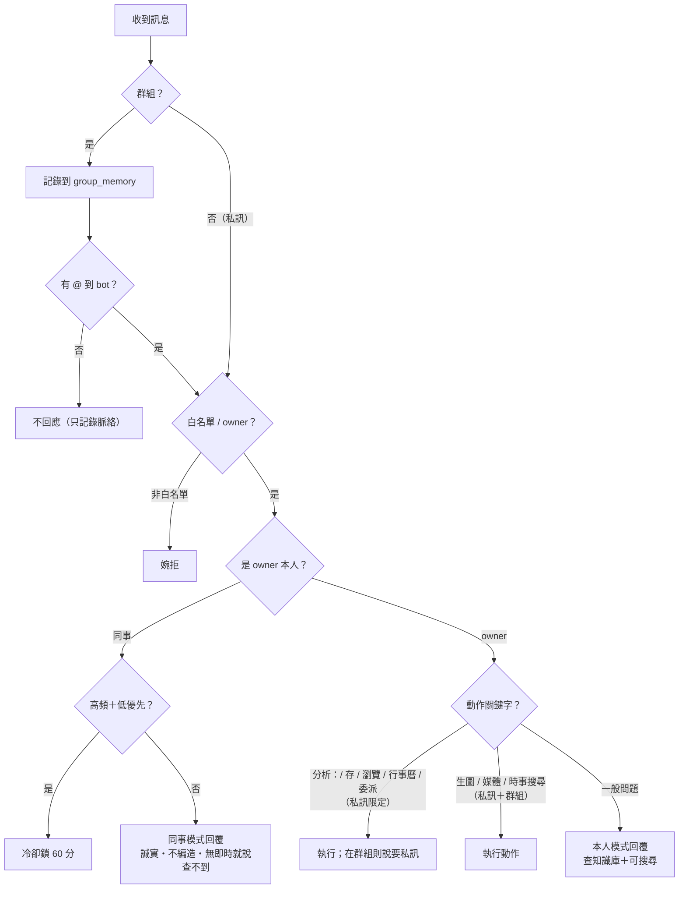

# JAYVIS──個人 AI 搭檔

<p align="center">
  
  
  
  
  
  
</p>

> **JAYVIS** 是一個自架的個人 Telegram AI 搭檔。當你不在線（或請假）時，同事可以**私訊它**或在工作群組**「@ 它」**，它會用**自己的搭檔人設**（幽默、有台灣味、會表明「我是你的搭檔」、**不冒充你本人**）、根據**Jason Obsidian 筆記知識庫** ([請參考 Another_Me_Architecture](#https://github.com/Jasonli1991/Another_Me_Architecture))、GitHub commits、Telegram 對話）誠實回答 —— 沒把握就老實說、不編造。附帶一個桌面**控制台**把所有設定點一點就好，**全部跑在本機**（單一檔 SQLite，不需要任何資料庫伺服器）。

---

## 目錄

- [這是什麼、適合誰](#這是什麼適合誰)
- [功能總覽](#功能總覽)
- [技術架構](#技術架構)
- [系統需求／建議規格](#系統需求建議規格)
- [快速開始](#快速開始手把手教學)
- [設定詳解](#設定詳解)
- [控制台逐卡說明](#控制台逐卡說明)
- [怎麼用：你本人 / 同事 / 群組](#怎麼用你本人--同事--群組)
- [私訊 vs 群組 功能對照表](#私訊-vs-群組-功能對照表)
- [運作原理](#運作原理)
- [請假、本週重點、請假彙整](#請假本週重點請假彙整)
- [資料儲存（`~/.n/`）](#資料儲存n)
- [專案結構](#專案結構)
- [換人使用（多租戶）](#換人使用多租戶)
- [常見問題 FAQ](#常見問題-faq)
- [測試](#測試)
- [授權](#授權)

---

## 這是什麼、適合誰

JAYVIS 是給「希望請假/離線時，同事仍能問到事情」的人用的個人搭檔：

- **你本人**私訊它 → 它是你的私人搭檔：查知識庫、查時事、生圖、改圖、管行事曆/信、看網頁、甚至把程式問題委派給 Coding Agent。
- **同事**（白名單內）私訊或在群組 @ 它 → 它用「**你的搭檔**」身分回答，只依知識庫、誠實、不冒充你本人、不亂掰你的私事。
- 全部**本機執行、long polling**，不需要公開網址、不需要 Postgres。

---

## 功能總覽

| 功能 | 說明 |
|------|------|
| **知識庫問答（RAG）** | 對 Obsidian＋GitHub commits 做混合檢索（dense 向量＋FTS5＋RRF 融合＋rerank），並帶入過往對話記憶（recall）；信心不足時**誠實說資料不足**並附來源，而不是硬掰。 |
| **讓 JAYVIS 認識自己（自我說明）** | 內建使用說明隨 repo 出貨，重建索引／面板一鍵自動灌進 KB；不需 Obsidian/GitHub，被問到自己的設定／功能／怎麼操作時據此**誠實回答**，而非憑空亂掰。 |
| **長期認識（restart-proof）** | owner 私訊累積到一定輪數，背景用模型抽出「JAYVIS 對你的長期認識」畫像並持久化（**bot 重啟不歸零**），下次對話自動帶入；也可由聊天記憶匯入一次重建。畫像為觀察累積、非權威，與設定衝突時以設定為準。 |
| **聊天記憶匯入／匯出** | 控制台一鍵把你在別處（ChatGPT／Claude）與 LLM 的長期記憶以 JAYVIS `.json` 格式匯入，逐則走完整記憶管線（分塊＋向量＋長期整併），讓 JAYVIS 開箱即認識你；亦可匯出備份／搬遷。 |
| **JAYVIS 自己的人設** | 它是**有鮮明個性的搭檔**（幽默風趣、台灣味、有人情味），會表明「我是你的搭檔」、**絕不冒充你本人**、不編造你的私事。 |
| **本人 / 同事 / 群組三種模式** | 本人＝坦白的私人搭檔；同事＝同上人設、只依知識庫誠實作答；群組＝被 @ 才回、帶群組脈絡。 |
| **請假自動回覆** | 依你設定的「請假日期區間」自動判定狀態，告訴同事你是否請假、何時回來。 |
| **LLM 代擬本週重點** | 面板一鍵，從近期對話／commits／近期筆記／一句方向，幫你擬一份「本週重點／交接重點」草稿，編修後再儲存。 |
| **請假期間彙整** | 把請假區間內同事與搭檔的對話整理成「已處理項目＋待辦」，面板顯示並發到你的 TG；請假結束自動 DM 你一次。 |
| **多供應商模型路由** | 依模型名稱前綴自動分流 **Gemini / Claude / OpenAI / 本地 Ollama**；面板金鑰一律遮罩。 |
| **時事搜尋（Tavily）** | owner 限定：你本人問股價/天氣/新聞等時效性問題時，先搜尋再帶來源回答。 |
| **生圖、媒體工具、網站瀏覽** | owner 限定：自動配圖（Pollinations.AI）、圖片去背/轉檔/調尺寸、借用 Chromium 看網頁並操作。 |
| **行事曆 / 收發信（macOS）** | owner 限定，預設關閉、寫入前先問你確認，透過 AppleScript 驅動 Calendar.app / Mail.app。 |
| **程式委派** | owner 限定：把本機專案的程式問題交給 headless Coding Agent 問答／擬修復計畫／改碼開 PR。 |
| **分析模式** | 面板（或私訊 `分析：…`）廣撈知識庫＋強模型，產出**自帶 Chart.js 的 HTML 報告**存進 Obsidian Inbox 並自動開啟，可「接續修改」出新版本。 |
| **控制台 App** | 原生視窗（亮/暗主題）管理身份、請假、白名單、模型、重建索引、動作工具、瀏覽、分析，並可啟動/停止/重啟 bot＋看即時 log（每行帶時間戳、每次 LLM 呼叫附 token 用量）。 |
| **出錯自我診斷** | 發生未預期錯誤時，自動用**你自己設定的 LLM**把錯誤＋近期 log（已濾 token）變成白話「原因／影響／建議」DM 給 owner，並格式化成**可直接轉給作者**的回報；全程本機、不對外回報、只給建議不自動改碼。 |
| **本機優先、零伺服器** | 單一檔 SQLite 知識庫＋本地向量；不需要資料庫伺服器。 |

---

## 技術架構

| 層 | 技術 |
|----|------|
| **live 入口** | Python 3.11 · `python-telegram-bot` 21.9（Bot API，long polling） |
| **知識庫** | SQLite（FTS5）＋ numpy 餘弦相似度 ＋ Python RRF 融合（零伺服器） |
| **Embedding / rerank** | sentence-transformers（`BAAI/bge-m3`、`bge-reranker-v2-m3`） |
| **LLM 閘道** | google-genai（Gemini）· Anthropic · OpenAI · 本地 Ollama（OpenAI 相容）；依模型名前綴分流 |
| **控制台** | Flask（127.0.0.1:8765）＋ pywebview 原生視窗 |
| **知識來源** | Jason Obsidian vault · GitHub commits（灌入 KB）· 私訊／群組對話記憶（回覆時 recall） |
| **選用能力** | Tavily（時事）· Pollinations.AI（生圖）· Playwright Chromium（瀏覽）· rembg/Pillow（媒體）· AppleScript（行事曆/信，macOS） |

> 註：`python-telegram-bot` 的 JobQueue 需要 apscheduler（本專案未安裝），所有排程（如請假結束自動彙整）改用 **asyncio 背景任務**達成。

---

## 系統需求／建議規格

- **平台**：macOS，**Apple Silicon（M 系列）最佳**——本地 embedding／rerank 會走 MPS 加速。Intel／Linux 可跑 bot，但本地模型走 CPU 較慢；控制台（pywebview）以 macOS 為主。
  - **Windows**：核心 bot 與知識庫可跑（單一實例鎖已跨平台，Windows 改用本機埠互斥）；但行事曆／收發信（AppleScript）為 **macOS 限定**、桌面控制台（pywebview）亦以 macOS 為主，Windows 上以 CLI 為主（`python bot.py`／`python -m panel` 走瀏覽器）。
- **Python 3.11**。
- **記憶體**：建議 **16GB**——本地會載入 `bge-m3`（嵌入）與 `bge-reranker-v2-m3`（重排）兩個約 5.6 億參數的模型；8GB 可跑但較吃緊。
- **硬碟：建議至少預留 10GB**（要裝 LibreOffice 抓 ~12GB 更從容）：

| 項目 | 約佔 |
|------|------|
| Python 套件 `.venv`（含 PyTorch） | ~1.3 GB |
| 本地模型（**首次執行自動下載**到 `~/.cache/huggingface`） | ~6.5 GB（bge-m3 4.3G＋bge-reranker 2.1G＋MiniLM 0.1G） |
| 瀏覽工具 Chromium（playwright） | ~0.8 GB |
| LibreOffice（選用，文件轉檔才需要） | ~1 GB |
| 知識庫 `~/.n/`（隨使用增長） | 數十 MB 起 |

> ⚠️ **首次啟動會自動下載約 6.5GB 本地模型**（embedding＋reranker），需要時間與穩定網路；下載完成後即可離線使用。

---

## 快速開始

### 步驟 0｜先準備

- **Python 3.11**。
- 一支 **Telegram Bot**：在 Telegram 找 **@BotFather** → `/newbot` → 取得 **Bot Token**。
- 你的 **Telegram 數字 id**：找 **@userinfobot** 取得（這是 `OWNER_CHAT_ID`，決定誰是「你本人」）。
- 至少一個 **LLM 金鑰**（Gemini 有免費額度，最好上手），或一個本地 **Ollama**。

### 步驟 1｜安裝

```bash
git clone <your-fork-url> jayvis && cd jayvis
python3.11 -m venv .venv && source .venv/bin/activate
pip install -r requirements.txt
cp .env.example .env          # 之後填金鑰（見「設定詳解」）
```

> 之後文件一律用 `.venv/bin/python` 代表虛擬環境的 Python（已 `source` 啟用後也可直接 `python`）。

### 步驟 2｜填設定（兩種方式擇一）

**方式 A（推薦）：開控制台用點的。**

```bash
.venv/bin/python -m panel
```

會開一個原生視窗（背後是 127.0.0.1:8765 的 Flask）。在裡面填「身份設定」「Telegram（Bot Token＋你的 id）」「模型（金鑰）」即可，存檔會寫進 gitignore 的本機檔。

**方式 B：直接編輯檔案。**

- `.env` —— 金鑰、id、模型、路徑（見下節變數表）。
- `prompts/owner_profile.json` —— 你的身份（名字、職稱、公司、專案、團隊、老闆、轉介規則）。範本：`prompts/owner_profile.example.json`。
- `prompts/WeeklyFocus.md` —— 本週重點＋請假日期。範本：`prompts/WeeklyFocus.example.md`。

> 這些個人檔**都不會進版控**；若不存在，JAYVIS 會自動退回 `.example` 範本，所以一裝好就能跑。

### 步驟 3｜綁定 [Jason 的第二大腦知識庫](#https://github.com/Jasonli1991/Another_Me_Architecture)（選用，但建議）

```bash
.venv/bin/python backfill.py     # 首次會下載 embedding 模型，建立 ~/.n/kb.sqlite
```

或在控制台「重建索引」卡按一下（有即時進度 log）。沒設 Obsidian/GitHub 也能跑，只是沒有 RAG 來源。

> **GitHub commits 來源需先裝並登入 GitHub CLI**：`brew install gh` → `gh auth login`（選 GitHub.com → HTTPS → 瀏覽器登入）。抓 commit 是呼叫 `gh`、不是放 token；沒裝/沒登入會抓不到（重建索引會明確提示原因）。`gh` 帳號的權限決定能讀哪些 repo（公開皆可、私有需有權限）。Obsidian 來源不需要 `gh`。repos 在控制台「記憶管理」卡填，每行一個 `owner/repo`。

### 步驟 4｜啟動

```bash
.venv/bin/python -m panel        # 推薦：用控制台設定 + 啟動/停止/重啟 bot
# 或
.venv/bin/python bot.py          # 直接跑 bot（long polling，不需公開網址）
```

控制台頂部有「啟動／停止／重啟」按鈕，改完設定按「重啟」即可生效。

### 步驟 5｜（要在群組用就做）關閉 Telegram 隱私模式

預設 BotFather 會開「群組隱私模式」，bot **收不到群組訊息**。要在群組用：

1. **@BotFather → `/setprivacy` → 選你的 bot → Disable**。
2. **把 bot 移出群組再重新加入**（此設定只對「之後加入的群組」生效，務必重加）。
3. 或者：直接把 bot **設成群組管理員**（管理員會繞過隱私模式）。

---

## 設定詳解

所有真正的設定都由 `.env`（或控制台寫入的本機檔）驅動，**個人資料一律不進版控**。`.env.example` 內有完整中文註解，這裡列重點：

| 變數 | 說明 | 預設 |
|------|------|------|
| `TG_BOT_TOKEN` | @BotFather 給的 Bot Token。 | （必填） |
| `OWNER_CHAT_ID` | 你的 TG 數字 id —— 唯一能觸發「本人模式」與動作工具的人。 | `0`（關） |
| `ALLOWLIST_USER_IDS` | 逗號分隔的同事 id；只有名單內＋你本人，bot 才回應。 | 空 |
| `GEMINI_API_KEY` / `ANTHROPIC_API_KEY` / `OPENAI_API_KEY` | 模型金鑰，用到哪家填哪家。 | 空 |
| `OPENAI_BASE_URL` | OpenAI 相容端點（如本地 Ollama `http://localhost:11434/v1`）；設了之後，非 `gemini-*`/`claude-*`/`gpt-*` 的模型名都走這裡。 | 空 |
| `MODEL_GENERAL` / `MODEL_CODE` | 一般模型／高階模型名稱；**供應商由名稱前綴自動判定**。 | `gemini-2.5-flash` / `gemini-2.5-pro` |
| `RETRIEVAL_THRESHOLD` | 檢索信心門檻（低於就傾向誠實說資料不足）。 | `0.3` |
| `OBSIDIAN_PATH` | Obsidian vault 路徑（留空＝跳過 Obsidian）。 | 空 |
| `GITHUB_REPOS` | 逗號分隔 `owner/repo`，追蹤 commit（空＝不追；需先 `brew install gh` + `gh auth login`）。 | 空 |
| `CODE_ROOT` | 本機專案母資料夾（子資料夾＝一個專案），供 owner 程式委派。 | 空 |
| `CODE_ASK_BUDGET_USD` / `CODE_APPLY_BUDGET_USD` | 程式問答/計畫、改碼+PR 的花費上限（美元）。 | `5` / `15` |
| `TAVILY_API_KEY` | 時事搜尋金鑰（tavily.com）。 | 空 |
| `KB_PATH` | SQLite 知識庫路徑。 | `~/.n/kb.sqlite` |

> 記憶層微調（多數人不必動，詳見 `.env.example`）：`MEMORY_RECENT_TURNS`／`MEMORY_RECALL_N`／`MEMORY_MIN_CHARS`／`MEMORY_RECENT_ACTIONS`（owner 私訊常駐「最近做過的事」筆數，預設 `6`——讓 JAYVIS 記得自己剛排了行程／寄了信，下一輪不忘）。

**功能開關**（建議用控制台「動作工具／網站瀏覽」卡開關；以下為 `.env` 對應，預設全關）：

| 變數 | 功能 |
|------|------|
| `MEDIA_ENABLED` | 媒體工具（圖片去背/轉檔/調尺寸；去背需 `pip install "rembg[cpu]"`，文件轉檔另需 LibreOffice）。 |
| `SEARCH_ENABLED` | 時事搜尋（需 `TAVILY_API_KEY`）。 |
| `IMAGE_GEN_ENABLED` | 自動配圖（Pollinations.AI，免金鑰）。 |
| `BROWSE_ENABLED` | 網站瀏覽（Playwright Chromium，CDP `localhost:9222`）。 |
| `ACTIONS_ENABLED` | 行事曆動作（macOS）。 |
| `EMAIL_ENABLED` | 收發信（macOS）。 |

> **安全**：面板讀金鑰/token 的 API **只回傳「是否已設定」的布林值、永遠不吐明文**；面板綁定 localhost，並有跨來源／Host 保護。

---

## 控制台逐卡說明

`.venv/bin/python -m panel` 開原生視窗（亮/暗主題）。頂部控制列：**啟動／停止／重啟 bot ＋ 即時 log**。

| 卡片 | 用途 |
|------|------|
| **身份設定** | 名字／職稱／公司／專案／團隊／老闆／轉介規則 → 寫入 `owner_profile.json`。搭檔名稱自動＝「名字 的搭檔」。 |
| **請假與本週重點** | 狀態（依日期區間自動判定）／請假期間（日曆選區間）／**方向框＋「幫我擬本週重點」**（LLM 草擬）／本週重點／**請假期間彙整**按鈕。 |
| **Telegram** | Bot Token（遮罩）＋白名單同事（id＋別名，別名僅顯示用）。 |
| **模型** | 一般模型／高階模型（可點選本地模型）＋「重新整理」可用模型清單＋檢索門檻＋各供應商金鑰（遮罩）＋相容端點。 |
| **記憶管理** | 上：Obsidian 路徑＋GitHub repos 一鍵重建知識庫（即時進度 log）；**「讓 JAYVIS 認識自己」**按鈕把內建使用說明灌進 KB，初次使用一鍵就讓 JAYVIS 答得出自己的設定／功能（不需 Obsidian/GitHub）。下：依對象檢視／清除對談記憶；**owner 聊天記憶匯入／匯出**——把你在別處與 LLM 的長期記憶匯入，讓 JAYVIS 一開始就認識你（限定 JAYVIS `.json` 格式，見下）。 |
| **動作工具** | 寄件帳號（選填）＋媒體工具／時事搜尋（含 Tavily 金鑰）／自動配圖 開關。 |
| **網站瀏覽** | 啟用網站瀏覽（首次下載專用 Chromium ~350MB；在專用視窗登入要瀏覽的網站）。 |
| **分析** | 在面板輸入問題 → 廣撈知識庫＋強模型 → 產出 HTML 報告（面板用，也可私訊 `分析：`）。 |
| **解除安裝** | 回收 JAYVIS 為運作而裝的外部元件空間。掃描後分三區：**JAYVIS 安裝的**（可安全移除）／**偵測到的相關項目**（來源不明、可能被別程式共用，預設不勾）／**JAYVIS 資料**（知識庫等）。需輸入 `移除JAYVIS` 二次確認、且**先停止 bot**。只刪「裝前原本沒有、由 JAYVIS 裝上」的，不誤刪你原有或別程式共用的。 |

> 大多數設定改完需**重啟 bot** 生效（白名單即時生效、分析模式免重啟）。
>
> 解除安裝後：**本地模型**會在下次用到知識庫／記憶時自動重新下載（RAG 核心，無法避免）；**Chromium／LibreOffice 不會**自動重裝，要再用時於對應卡片按「安裝」即可。

**聊天記憶匯入格式**（`匯出我的記憶` 會產生、`瀏覽…匯入` 只收此格式 `.json`，可來回）：

```json
{
  "jayvis_memory_version": 1,
  "person": "owner",
  "turns": [
    {"ts": "2026-01-01 10:00:00", "role": "user", "content": "…"},
    {"role": "assistant", "content": "…"}
  ]
}
```

`turns` 每筆 `role` 須為 `user`／`assistant`、`content` 為非空字串；`ts` 選填（缺則用匯入時間）。從 ChatGPT／Claude 匯出的對話請先轉成此格式。匯入會逐則走完整記憶管線（分塊＋向量索引＋長期整併），故首次匯入可能觸發本地模型下載；需先設好「你的 TG id（owner）」。可勾**「匯入後重建長期認識」**（預設開）——用模型從匯入內容抽出對你的長期畫像（即「JAYVIS 對你的長期認識」），有 token 成本、背景跑並顯示進度。

---

## 怎麼用：你本人 / 同事 / 群組

### 你本人（私訊，`OWNER_CHAT_ID`）

直接私訊 bot 即可。除了一般問答（會查知識庫），這些是**關鍵字／指令**（多為私訊限定，括號標註）：

| 你打的話 | 觸發 |
|----------|------|
| 任何問題 | 知識庫問答（查不到會誠實說，並可問你要不要記進 Obsidian） |
| `分析：<問題>` | 深度分析 → HTML 報告存 Obsidian Inbox 並自動開啟（私訊限定） |
| 回「`存`」 | 把上一則知識問答存進 Obsidian `00_Raw/Inbox`（私訊限定） |
| 傳圖/檔 ＋「幫我去背 / 轉成 pdf / 縮到 1080 寬」 | 媒體工具（私訊＋群組） |
| 接著只打「去背」 | 對剛傳的那張圖下指令（媒體跟進；私訊＋群組） |
| 「幫我畫一隻貓…」 | 自動配圖（私訊＋群組） |
| 「今天台積電股價？／台北天氣？」 | 時事搜尋 Tavily（私訊；可設定開放群組） |
| 「幫我看 example.com／截圖…」 | 網站瀏覽（私訊限定，送出/發布前會問你確認） |
| 問某專案的程式問題 → 回「`修復計畫`」→ 回「`執行`」 | 程式委派：問答 → 擬計畫 → 改碼開 PR（私訊限定） |
| 「幫我在行事曆新增…／收信摘要」 | 行事曆/收發信（macOS，私訊限定，寫入前確認） |

> 初次使用建議先到控制台「記憶管理」按一下「**讓 JAYVIS 認識自己**」——在那之前若你問它「你能做什麼／你的設定」，它會老實說自己還沒被灌入完整說明、並提醒你按這顆按鈕（而不是憑空亂掰自己的功能）。

### 同事（白名單內）

私訊或群組 @ 它，會走「**你的搭檔**」人設：

- 只依知識庫回答；查不到的通用/技術問題會盡力答，但**涉及你的私事且無資料 → 誠實說沒資料、幫你轉達，絕不編造**。
- **時效性問題**（股價/天氣/新聞，同事沒有搜尋權）→ 誠實說查不到即時資訊、建議問你或自查，**不拿舊資料硬掰**。
- **冷卻閘**防洗版：10 分鐘內超過 5 則、且整批被判定為「閒聊/不急」→ 鎖 60 分鐘並回「我先忙一下…」。你本人與老闆豁免。單純問一句非公事**不會**被擋。

### 群組

- bot **只在被 @ 時回應**；但會記錄群組所有訊息建立脈絡。
- 非白名單的人 @ 它 → 婉拒。
- **你本人在群組（被 @）** 可用：生圖、媒體工具、時事搜尋。
- 群組**擋掉**：網站瀏覽、行事曆、收發信、程式委派、分析、存 Inbox —— 且 bot 會**誠實說「這要私訊才能做」**，不會假裝在處理。

---

## 私訊 vs 群組 功能對照表

| 功能 | 你本人・私訊 | 你本人・群組（被 @） | 同事 |
|------|:---:|:---:|:---:|
| 知識庫問答 | ✅ | ✅ | ✅（同事人設） |
| 時事搜尋（Tavily） | ✅ | ✅ | ❌（會誠實說查不到） |
| 生圖 | ✅ | ✅ | ❌ |
| 媒體工具（去背/轉檔） | ✅ | ✅ | ❌ |
| 網站瀏覽 | ✅ | ❌ | ❌ |
| 行事曆 / 收發信 | ✅ | ❌ | ❌ |
| 程式委派 | ✅ | ❌ | ❌ |
| 分析模式 `分析：` | ✅ | ❌ | ❌ |
| 存進 Obsidian Inbox | ✅ | ❌ | ❌ |

---

## 運作原理

### 整體架構與資料流



### 訊息路由決策流程



**知識庫與檢索**：知識庫是單一檔 `~/.n/kb.sqlite`（`chunks` 表＋FTS5）。檢索＝dense 向量（numpy 餘弦）＋FTS5 全文＋RRF 融合＋rerank，低於門檻就傾向誠實說資料不足。**KB 灌檔來源**：Obsidian（`ingest/obsidian.py`，依 frontmatter 日期/mtime 補 `event_time` 以支援「近期筆記」）、GitHub commits（`github_sync.py`）、**JAYVIS 自我說明**（`ingest/self_doc.py`＋`docs/JAYVIS-使用說明.md`，隨 repo 出貨、重建索引時自動灌入，讓它開箱即「懂自己」、被問到設定/功能時據實回答），用 `backfill.py` 或面板「重建索引」重建。**Telegram 對話**則走另一條：每個人的私訊歷史與群組對話存成「對話記憶」，回覆時 `recall` 取用（不進 KB）。

---

## 請假、本週重點、請假彙整

- **請假狀態**：以你在面板設定的**日期區間**自動判定（不是從自由文字猜）。在請假區間內 → 同事會被告知你請假、何時回來。
- **本週重點**：always-on 的背景／交接資訊（不限請假時，平常同事問答也會參考）。可按「**幫我擬本週重點**」用高階模型從近期對話／commits／近期筆記／一句方向草擬，編修後再按「儲存請假設定」（AI 只出初稿、人把關，不自動存）。其中「近期筆記」依 chunk 的 `event_time` 取最新，**需先重建過一次索引**（重建會自動補 `event_time`）才抓得到。
- **請假期間彙整**：面板按「請假期間彙整」→ 把請假區間內「同事與搭檔的對話」整理成「已處理項目＋待辦/需你決定」，面板顯示並一併發到你 TG；**請假結束時 bot 也會自動 DM 你一次**。需先設好請假日期才會觸發（沒設不會動用模型）。

---

## 資料儲存（`~/.n/`）

所有本機資料都在家目錄的 `~/.n/`（不進版控）：

| 檔案 | 內容 |
|------|------|
| `kb.sqlite` | 知識庫（chunks＋FTS5）＋ per-人對話記憶。 |
| `allowlist.json` | 白名單同事 `[{id, alias}]`。 |
| `group_conversations.json` | 各群組最近對話（建立脈絡，per-chat）。 |
| `browse_allowlist.json` | 網站瀏覽的網域白名單。 |
| `chrome-browse-profile/` | 瀏覽用專用 Chromium 的 profile（cookie/登入）。 |
| `leave_digest_sent.txt` | 記錄請假彙整已自動發送，避免重發（發過才會出現）。 |
| `installed.json` | 卸載清單：記錄「由 JAYVIS 安裝」的外部元件，供「解除安裝」精準移除（清資料時會保留此檔）。 |

---

## 專案結構

```
jayvis/
├── bot.py              # live 入口：Telegram Bot（long polling）、所有訊息路由
├── assistant.py        # 組回覆：檢索 → 人設 → 模型（本人/同事/群組模式）
├── analysis.py         # 分析模式：廣撈 → 強模型 → HTML 報告（+接續修改）
├── focus_draft.py      # LLM 代擬「本週重點」草稿
├── leave_digest.py     # 請假期間彙整（同事項目+待辦；自動 DM）
├── websearch.py        # 時事搜尋：LLM 判斷該不該查 + Tavily
├── image_gen.py        # 自動配圖（Pollinations.AI）
├── browse_*.py         # 網站瀏覽（Playwright Chromium / CDP / 白名單 / 啟動看門狗）
├── code_delegate.py    # owner 程式委派（headless Coding Agent）
├── agent.py            # owner 動作工具（行事曆/收發信/媒體）派工
├── cooldown.py         # 同事冷卻閘（高頻+低優先 → 鎖）
├── llm.py              # 多供應商 LLM 閘道（Gemini/Claude/OpenAI/Ollama）
├── memory.py / group_memory.py  # per-人私訊記憶 / 群組對話
├── persona.py          # 人設組裝（owner_profile + 模板）
├── github_sync.py      # GitHub commit 摘要（TTL 快取）
├── backfill.py         # 建知識庫（自我說明 + Obsidian + GitHub → kb.sqlite）
├── docs/               # JAYVIS-使用說明.md（owner 導向自我說明，自動灌進 KB）
├── config.py           # 中央設定（env 驅動：模型/路徑/id/旗標…）
├── guard.py / safety.py # prompt injection 防護
├── db/                 # SQLite 連線 + schema（chunks + FTS5）
├── retrieval/          # 混合檢索 · rerank · 信心（誠實說資料不足）
├── ingest/             # Obsidian / GitHub / Telegram 切塊 + 灌入
├── panel/              # 控制台（Flask + pywebview）
│   ├── app.py  botctl.py  env_io.py  __main__.py  static/
├── prompts/            # persona_template.md · *.example.json/md（使用者檔 gitignore）
└── tests/              # pytest 測試套件（823 passed / 5 skipped）
```

---

## 多租戶

身份不寫死。要把 JAYVIS 給別人變成「他的」搭檔：

1. 改 `prompts/owner_profile.json`（或面板「身份設定」卡）—— 名字、團隊、轉介規則等。
2. 每個人保留自己本機的 `~/.n/kb.sqlite`（單一 owner、無 Postgres）。
3. 填自己的模型金鑰，或把 `OPENAI_BASE_URL` 指向本地 Ollama。
4. 白名單在 `~/.n/allowlist.json`（`[{id, alias}]`）。

> 身份／別名／模型／請假設定改完需**重啟 bot**（面板「重啟」鈕）。分析模式即時、免重啟。

---

## 常見問題 FAQ

**Q：群組 @ 它沒反應？**
A：99% 是 Telegram **群組隱私模式**沒關。私訊正常但群組收不到，就是它。照「快速開始 步驟 5」：BotFather `/setprivacy` → Disable → **移出再重加群組**（或把 bot 設群組管理員）。

**Q：模型端點名稱填什麼？**
A：模型名前綴決定供應商：`gemini-*`→Google、`claude-*`→Anthropic、`gpt-*`/`o*`→OpenAI、其它（如 `gemma:12b`、`qwen3:8b`）→走 `OPENAI_BASE_URL`（本地 Ollama 免金鑰）。面板「模型」卡的「重新整理」可列出各家可用模型。

**Q：改了設定沒生效？**
A：多數設定（人設、本週重點、token、模型、動作工具）是 bot 啟動時讀入，改完要按面板「**重啟**」。白名單即時生效、分析模式免重啟。

**Q：同事問非公事會被擋嗎？**
A：不會。單純一句非公事照樣盡力回（通用知識）。只有「短時間連發一堆閒聊」才會踩到冷卻閘鎖 60 分；不在白名單則一律婉拒。

**Q：同事沒有搜尋，問時事會亂答嗎？**
A：不會。同事問時效性問題（股價/天氣/新聞）時，搭檔會誠實說「查不到即時資訊、建議問本人或自查」，不拿過時記憶硬掰。

**Q：不小心開了兩隻 bot 會衝突嗎？**
A：不會。bot 有跨平台**單一實例鎖**（Unix `flock`／Windows 本機埠互斥），多餘的實例一啟動就拿不到鎖、立即自行結束，從源頭避免 Telegram `getUpdates` 的 Conflict 互搶。

---

## 測試

```bash
.venv/bin/python -m pytest tests/ -q
```

目前 **823 passed / 5 skipped**。5 個 skip 屬正常：需 macOS 真實 Calendar/Mail（`RUN_CALENDAR=1` / `RUN_MAIL=1`）、live LLM（`RUN_LIVE_LLM=1`）、或本機未裝 LibreOffice（文件轉檔）／onnxruntime（rembg 去背）才會跑。測試用 `pytest-randomly`（順序無關），KB 與 group_memory 在測試中皆導向暫存路徑，不污染正式資料。

---

## 授權

MIT —— 見 [LICENSE](LICENSE)。
